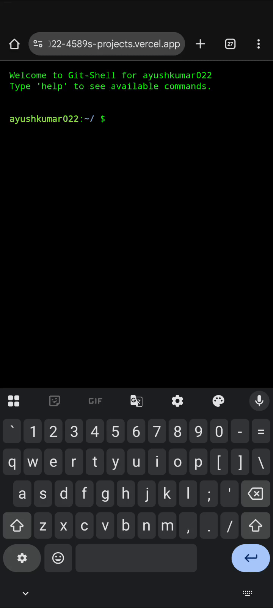

  

<h1 align="center">
  
</h1>

💻 <b>Full Stack Developer | MERN Enthusiast | Tech Explorer</b> 
🚀 Passionate about building interactive web apps and scalable backend systems. 
🎯 Always eager to learn, collaborate, and contribute to open source.

---

## 🚀 My Interactive Git-Shell 🚀

I built a custom web terminal that lets you browse my GitHub repositories using shell commands.

**(This is an animated demo. Click the link below to try the real thing!)**

### [➡️ Click Here to Try the Live Git-Shell ⬅️](https://git-shell-ks50mz0a7-ayushshaw022-4589s-projects.vercel.app)

You can use commands like:
* `ls` - to see my repositories.
* `cd <repo-name>` - to navigate into a project.
* `cat <file-name>` - to read files.
* `clear` - to clear the screen.
* `Tab` - for autocomplete!

---
* **Source Code for this project:** [github.com/ayushkumar022/git-shell](https://github.com/ayushkumar022/git-shell)

<h2 align="center">🌐 Connect With Me</h2>

  
  
  
  

---

<h2 align="center">💻 Tech Stack</h2>

  
  
  
  
  
  
  
  
  
  

---

<h2 align="center">⭐ Popular Projects</h2>

  
  

---

<h2 align="center">📊 GitHub Stats</h2>

  
  
  

---

  

---

### 💻 Coding Profiles

